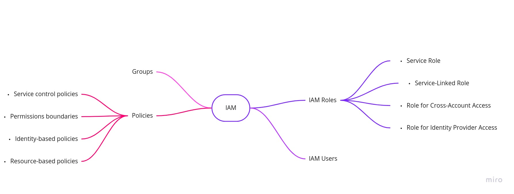

# Introduction

AWS Identity and Access Management (IAM), you can specify who or what can access services and resources in AWS, centrally manage fine-grained permissions, and analyze access to refine permissions across AWS.

## What are we going to learn

We are going to learn what are Users, Roles, Policies, Groups.

## Why IAM

 Imagine small example, if you are attending some tech talk or some conference. The first step that you would do is register yourself, they'll send you an email for conformation & on the day of the event based on that code/confirmation they will give you an ID card. Here your ID will work as your identity. Similary in the AWS also no matter what all of em should first approach the IAM to get their identity :)

*We will focus on the roles & policies*

## References

- [Introduction to IAM](https://aws.amazon.com/iam/)